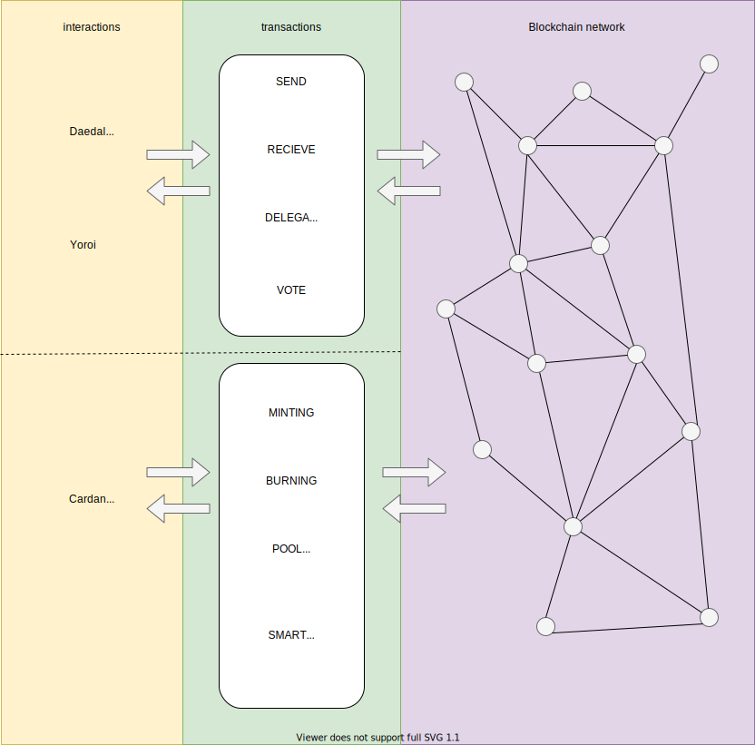

:::note
There are currently two ways to make your NFTs:

- For the not so tech-savvy through someone else. The [showcase section](../../showcase/?tags=nft) has a few services that offer this.
- For the more tech-savvy on a Cardano node. If you want to have full control over your tokens, you need to mint them **yourself**. And this is what this section is all about.

Minting requires a certain amount of skill in navigating and working with Linux through the terminal as well as a running Cardano node.

We will not go into the details on how to spin up a Cardano node, but this is covered in the [integrate Cardano category](../getting-started/installing-cardano-node).
:::

## What are native tokens/assets?

The Cardano Blockchain features a unique ability to create, interact and destroy custom tokens (or so-called 'assets') in a native way.
Native, in this case, means besides sending and receiving the official currency ada, you can also interact with custom assets out of the box - without the need for smart contracts.

The functionality is already built-in, and native assets can almost be treated like ada in every way. There are some constraints (which we will cover later), but for now, you can imagine native assets as a possibility to generate your own custom. 

## What you need to know 
Here's a brief overview of what you need to know before we dive in any deeper.

### How we interact with the blockchain
Pretty much every interaction with the Cardano network/blockchain comes down to a transaction. With this in mind, we can break interactions down into two layers.

The top layer is more focused on a visual approach and covers regular interaction. 
This includes sending and receiving ada or tokens, delegating your stake or voting. All of those interactions can be done through wallets like the full node Daedalus wallet or the more lightweight Yoroi wallet.

But if we want to drill down and have more possibilities to interact and make more "custom" interactions, we need to go one layer below. 
In this layer, we need a full node to issue transactions with custom parameters. 
A full node is - most of the time - a compiled binary of the official latest cardano-node repository. There are alternatives out there, but we'll focus on the Linux version.

So what kind of advanced transactions can we build with a full node, and how?
The current way is to work with the command line and issue your transactions from there. 
Stake pool operators need to use this way of making transactions to - for example - register their stake pool or make adjustments to their pledge etc.
But we can also use this way to create, send, receive or burn token.

In the future, this probably will also be the place where smart contracts are written, tested and maybe executed if there isn't a visual frontend.

### Constraints when working with tokens

Since we already learnt that interaction with the network is almost always a transaction, we need to be aware of a few things enforced through network parameters.

1. Issuing a transaction and sending something always requires a fee to be paid. 
As of now, the fee depends on the size of the transaction (read: how much "information" gets sent). The size varies from a simple transaction like "A sends 2 ada to B" to a much more complex transaction that may have additional metadata attached to them.
2. There is a minimum value that needs to be sent. The value is currently set to 1 ada. This means if we want to send a token, we at least need to include 1 ada to the transaction. This is to prevent creating large sums of custom tokens and spamming the network with custom token transactions.
3. We currently (June 2021) have no standard way to define an NFT. There is a [open pull request](https://github.com/cardano-foundation/CIPs/pull/85), however. Most of the current NFTs on Cardano mostly follow the proposed structure, as we will in this section.

Please keep those constraints in mind if you want to work with native assets.

## Difference between "regular" token and NFTs

Technically speaking, there is no real difference between "regular" token/native assets and NFTs. 
Both of them can be created with a transaction issued through the cardano node cli and are native assets.

Compared to "regular" native assets ranging from only 1 unit to multiple millions, an NFT is a single native asset that can not be re-minted or destroyed, living forever on the blockchain.

